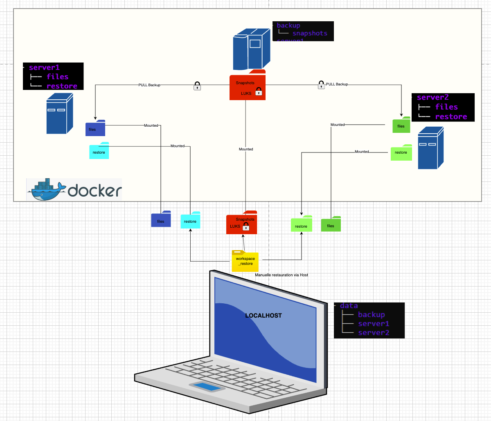

# Automated & Secure Backup Project (LUKS + Hardlinks Version)

This repository implements an optimized evolution of the standard rsnapshot backup strategy. 
By moving encryption from the file level to the storage level (Disk Encryption), we unlock the full potential of **filesystem deduplication**.

## The Challenge: Encryption vs. Deduplication (the new "Recipe")
In a standard GPG-based backup, every encryption cycle creates unique binary data (high entropy). This makes it impossible for `rsnapshot` to reuse data via hardlinks, leading to massive disk space waste.

**Our Solution:**
* **LUKS (Linux Unified Key Setup)**: The backup volume is encrypted at the block level (AES-256).
* **Direct Pull**: Rsnapshot retrieves files directly via SSH without intermediate archiving.
* **Result**: Total security at rest AND zero disk usage for identical files across snapshots.


## Solution Architecture

We have industrialized this strategy by using **Docker** to simulate a real infrastructure composed of 3 independent machines.



### Components
1. **Backup Server (Rsnapshot)**: The orchestrator. It initiates the SSH connection (Pull), retrieves raw files directly, and manages history (snapshot rotation).
2. **Client Servers (Server1 & Server2)**: Data sources. They host the files to be protected. Unlike the standard version, no local encryption/compression is needed, reducing CPU load on clients.
3. **Localhost (Host)**: The administrator machine. It handles the **LUKS layer** (opening/mounting the encrypted container) and provides persistent storage for the Docker volumes.

---

---

## Prerequisites & Initial Setup

Before the first run, you need to install the LUKS management tools and create the encrypted container image.

### 1. Install Cryptsetup
On Ubuntu/Debian:
```bash
sudo apt update && sudo apt install cryptsetup -y

```

### 2. Create and Format the Encrypted Disk Image

We create a virtual disk and format it with LUKS:

```bash
# 1. Create an empty 500MB file (adjust size as needed)
truncate -s 500M encrypted_disk.img

# 2. Format the file as a LUKS partition (you will set your passphrase here)
sudo cryptsetup luksFormat encrypted_disk.img

# 3. Open the volume to map it to a virtual device (/dev/mapper/backup_disk)
sudo cryptsetup luksOpen encrypted_disk.img backup_disk

# 4. Create an EXT4 filesystem inside the encrypted container
sudo mkfs.ext4 /dev/mapper/backup_disk

```

---

##  Installation and Startup

### 1. Mounting the Encrypted Volume

Every time you want to start the backup system, you must unlock and mount the disk:

```bash
# Open LUKS volume
sudo cryptsetup luksOpen encrypted_disk.img backup_disk

# Mount to the data folder
sudo mount /dev/mapper/backup_disk ./data/backup

```

### 2. Startup Containers

```bash
docker compose up -d --build

```

---

##  Proof of Deduplication (The Inode Test)

To verify that the hardlinks are working correctly, run two successive backups and compare the Inodes. If the Inode numbers are identical, the files occupy the same physical space on the disk.

```bash
# Run two backup cycles
docker exec -it backup rsnapshot alpha
docker exec -it backup rsnapshot alpha

# Check Inodes for a specific file
docker exec -it backup ls -li /snapshots/alpha.0/server1/server1files/files/hellosrv1.txt /snapshots/alpha.1/server1/server1files/files/hellosrv1.txt

```

**Expected Observation**: You will see the **exact same Inode number** for both paths, proving successful deduplication.

---

##  Security: Closing the Vault

To ensure "encryption at rest", always unmount and close the volume when the backup server is not in use. This renders the `encrypted_disk.img` completely unreadable without the passphrase.

```bash
# 1. Stop containers
docker compose down

# 2. Unmount the folder
sudo umount ./data/backup

# 3. Close the LUKS device
sudo cryptsetup luksClose backup_disk

```

---

## Project Structure (Final State)

Once the LUKS volume is mounted and the first backup cycle is complete, the architecture looks as follows:

```bash
# Commande : tree -L 4

ree -L 4
.
├── Dockerfiles
│   └── ubuntu
│       ├── Dockerfile
│       ├── id_rsa
│       └── id_rsa.pub
├── README.md
├── backup.png
├── config
│   ├── cron
│   │   └── crontab
│   └── rsnapshot
│       ├── rsnapshot.conf
│       └── rsnapshot.log
├── data
│   ├── backup
│   │   ├── lost+found
│   │   └── snapshots
│   │       ├── alpha.0
│   │       └── alpha.1
│   ├── server1
│   │   ├── files
│   │   │   └── hellosrv1.txt
│   │   └── restore
│   └── server2
│       ├── files
│       │   ├── plouf.txt
│       │   └── plouf2.txt
│       └── restore
├── docker-compose.yml
├── encrypted_disk.img
└── worspace_restore
18 directories, 13 files

Voici la section complète en **Markdown propre**, prête à être copiée dans ton `README.md` du projet **rsnapshot-luks**.

---

````
# Backup & Restore – Command Recap (LUKS Version)

---

## 1. Unlock & Mount Encrypted Volume (Host)

Before starting the backup infrastructure:

```bash
sudo cryptsetup luksOpen encrypted_disk.img backup_disk
sudo mount /dev/mapper/backup_disk ./data/backup
sudo chown -R $USER:$USER ./data/backup
````

---

## 2. Start Infrastructure

```bash
docker compose up -d --build
```

---

## Rsnapshot Configuration Check

```bash
docker exec -it backup rsnapshot configtest
```

---

## Test Backup (Dry Run)

```bash
docker exec -it backup rsnapshot -t alpha
```

---

## Run Backup

```bash
docker exec -it backup rsnapshot alpha
```

---

## Verify Snapshot Dates

```bash
docker exec -it backup ls -l /snapshots/
```

---

## Verify Latest Snapshot Content

```bash
docker exec -it backup ls -R /snapshots/alpha.0/
```

---

## Check Logs

Show last 50 lines:

```bash
docker exec -it backup tail -n 50 /var/log/rsnapshot.log
```

Follow logs live:

```bash
docker exec -it backup tail -f /var/log/rsnapshot.log
```

---

# Hardlink Deduplication Proof

Run two backup cycles:

```bash
docker exec -it backup rsnapshot alpha
docker exec -it backup rsnapshot alpha
```

Compare inodes between snapshots:

```bash
docker exec -it backup ls -li \
/snapshots/alpha.0/server1/server1files/files/hellosrv1.txt \
/snapshots/alpha.1/server1/server1files/files/hellosrv1.txt
```

If the inode numbers are identical, hardlink deduplication is working correctly.

---

# Restore Procedure (LUKS Version)

## 1. Prepare Workspace (Host)

```bash
rm -rf workspace_restore/*
cd workspace_restore
```

---

## 2. Copy File from Snapshot

Example: restore from `alpha.1`

```bash
cp ../data/backup/snapshots/alpha.1/server1/server1files/files/hellosrv1.txt .
```

---

## 3. Verify File

```bash
ls -l
cat hellosrv1.txt
```

---

## 4. Inject File Back to Server Volume

```bash
cp hellosrv1.txt ../data/server1/restore/
```

---

## 5. Verify Inside Container

```bash
docker exec -it server1 ls -l /server1files/restore/
```

---

# Close Encrypted Vault (Security)

When finished:

```bash
docker compose down
sudo umount ./data/backup
sudo cryptsetup luksClose backup_disk
```

```

---
